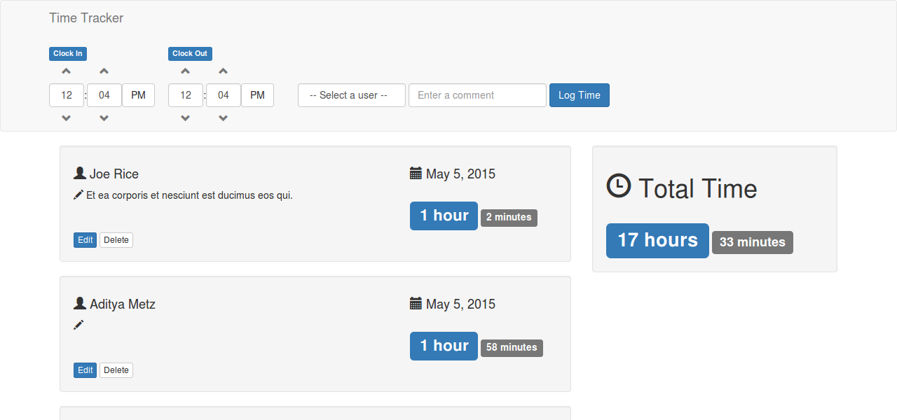

# Time Sheet

**Exploring Angular and Lumen.**

## Description

This was a small digression from a different project.  The purpose was to help think about a healthy way of merging AngularJS and Laravel 5--or any other framework on the backend.  Also took this as an opportunity to explore Laravel's lightweight Lumen.  

## Challenges

Workflow.  Keeping the IDE smart and getting real-time feedback.

Debugging ajax requests.

Angular.  It's new to me, it can be difficult to debug.

Lumen. I have criticisms now of Lumen. There's quite a bit to learn about Laravel internals from Lumen.  Much of the complexity is stripped out.  Well, it's commented out, so it's like a ghost showing you where things would be.  Playing with Lumen was a healthy exercise for this reason.  But in it's current state Lumen feels like a novelty.  It could use focus.  Imagine if the focus was changed from being "a minimalist framework" to being "an API creating machine"--which is sort of implied, but nowhere close to true.  They could add back the tools that streamline development: generators for example.  Add back resource routing.  Keep Auth as optional, and cut everything that isn't API/JSON related.  It could still be a lightweight framework, but following this vision it would have a practical purpose.  Some of the best parts of  Laravel are the dev-tools that automate repetitive tasks.  And these are sorely missing.  In short, I can't really imagine ever preferring Lumen over Laravel.